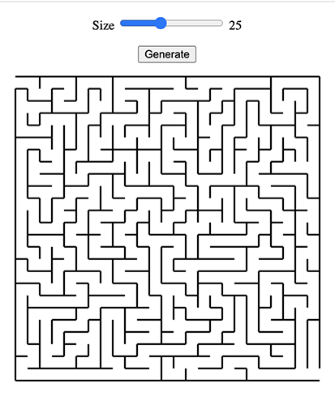

# Maze Generator

This repository is part of a Thing-a-Week challenge. This week’s theme is:

> Make something that generates things.

Still trying to avoid generating text with markov chains, so I wrote a maze
generator instead using a
[recursive backtracker algorithm](https://en.wikipedia.org/wiki/Maze_generation_algorithm#Recursive_implementation).

I rely on recursion to keep things simple (I did not implement an explicit
stack), so large mazes may exceed the stack limit. Keep the cell count <= 50.

**Demo:** [tboronczyk.github.io/taw-generate/src/index.html](https://tboronczyk.github.io/taw-generate/src/index.html)

---

